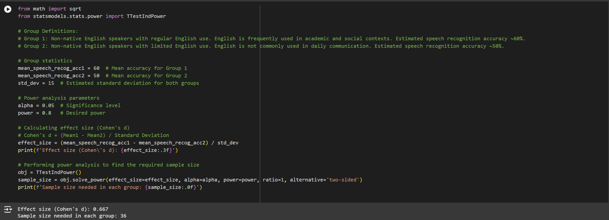
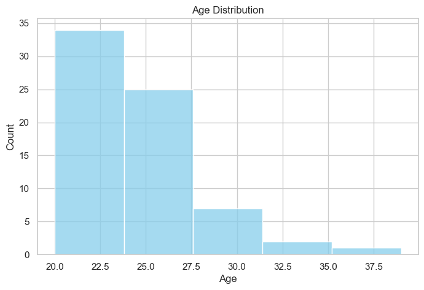
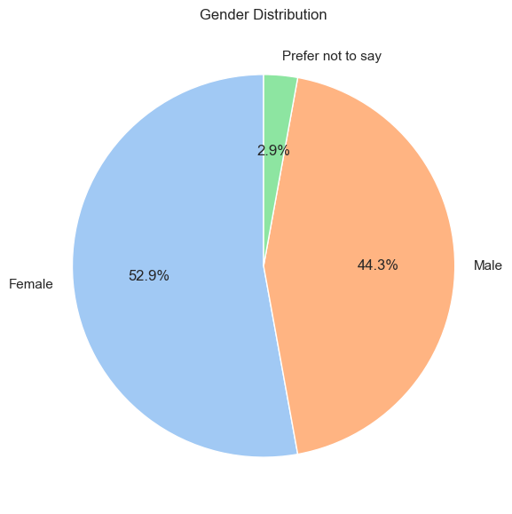
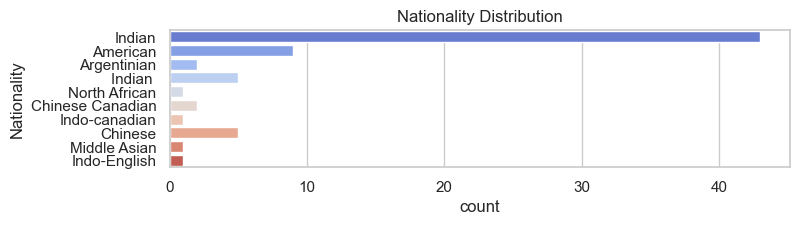
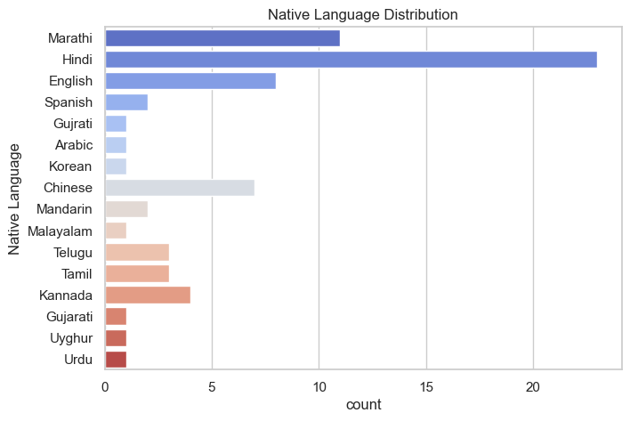
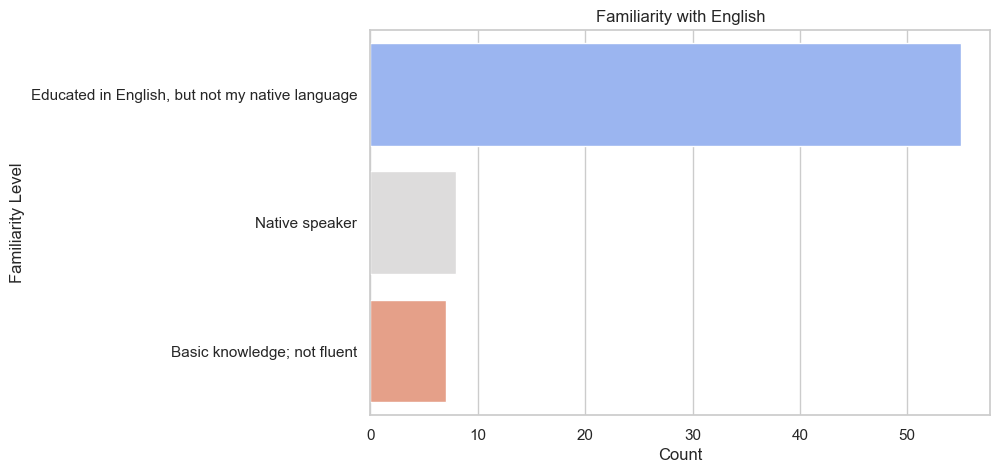
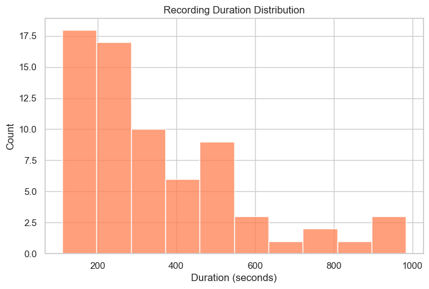

# Speech Recognition Bias Reduction Project

## Executive Summary
Welcome to the Speech Recognition Bias Reduction Project. It aims to create a more inclusive and representative dataset for improving automated speech recognition systems. This project addresses the challenges faced by speakers with non-native English accents, particularly when interacting with automated voice systems that struggle to interpret alphanumeric information such as names, phone numbers, and addresses.

Motivated by my personal experience as an international student moving to the United States in 2024, I aim to reduce delays, misinterpretations, and ineffective communication caused by accent-based biases in current voice recognition technologies.

## Objective
The primary goal is to create a diverse dataset of alphanumeric audio inputs. This dataset will focus on audio recordings from speakers with various accents, starting with the vibrant community of international students at Duke University.

It aims to tackle -  
Dataset Bias: Reduce native English bias and make voice recognition systems more inclusive.  
Efficiency/Equality: In a multicultural society, ensuring equality in access to services is crucial. 

## Potential Applications
- **Improving Voice Recognition:** Make speech systems better at understanding accents, especially when it comes to things like spelling out names or reading phone numbers.
- **Reducing Bias in AI:** Help make voice recognition tech more inclusive by reducing bias against non-native English speakers.
- **Linguistic Insights:** Provide data to understand how different accents impact the way people say things like phone numbers and addresses.
- **Language Learning & Accessibility:** Support tools for language learners or accessibility projects, helping AI understand a wider range of speech patterns.

## Review of Previous Datasets
Existing audio datasets primarily focus on word and sentence data to enhance representation of diverse accents: [Common Voice](https://commonvoice.mozilla.org/en?gad_source=1&gclid=Cj0KCQjw3bm3BhDJARIsAKnHoVXoYNubJdN3ST0gi3Qc0Q3im_G9C_ZPuhimJ527Vd2Q1Ixr2FrzaBMaAlXsEALw_wcB), [VoxCeleb](https://www.robots.ox.ac.uk/~vgg/data/voxceleb/), [LibriSpeech](https://www.openslr.org/12). Datasets focusing on “Phonetics” are

-	https://catalog.ldc.upenn.edu/LDC93S1: Focuses on American English dialects, which may not adequately represent non-native speakers.
-	https://archive.phonetics.ucla.edu/: An extensive archive that could be utilized to up sample the collected data.
-	https://en.arabicspeechcorpus.com/ : Valuable for Arabic language processing, but it doesn’t address English accents.
-	https://github.com/S-Malek/PCVC: focuses on Modern Persian speech, lacking relevance for English accents.

## Novelty
- **Focus on Alphanumeric Data:** The dataset specifically targets the recognition of letters and numbers, critical for automated systems that handle personal information.
- **Diverse Accent Representation:** The dataset will prioritize non-native English speakers, enabling a nuanced understanding of how various accents influence recognition accuracy.
- **Rich Metadata:** Detailed demographic information allows for in-depth analysis and helps identify patterns in recognition challenges faced by different accent groups.

## Dataset Description and Collection Protocol / Tools Used
Please refer `docs/collection_protocol.md` and `docs/dataset_description.md`.

## Power Analysis

The calculated sample size is approximately **36 participants per group**.

For Group 1, there are 55 data points fulfilling the power analysis expectation. However for Group 2, the data falls short of 29 participants.

## Exploratory Data Analysis
The age distribution of participants skews towards the 20–30 age range, reflecting the demographic characteristics of the survey population, which predominantly consists of university students. However, this limited range does introduce age representation bias.

The gender distribution in the dataset is balanced ensuring that models trained on the dataset can generalize reasonably well across genders.

Both nationality and native language distributions reveal noticeable representation bias. A substantial proportion of participants hail from India, likely due to the my community access. This concentration also results in overrepresentation of Hindi (India's national language) and Marathi (my native language). This bias limits the diversity of accents in the dataset. Future users of the dataset may need to augment or balance the data to achieve more equitable representation of accents and linguistic backgrounds.

Despite the class imbalance in the "Familiarity with English" distribution, it effectively captures the necessary data for the intended study, with each group represented. The imbalance is likely a cascading effect of the nationality distribution, as the majority of participants are Indian students who are typically educated in English alongside their native language.

### Survey Completion Insights
The average time to complete the survey was approximately 5.9 minutes, indicating that the process was relatively streamlined. However, platform limitations in Qualtrics, which lacks native audio recording capabilities, required participants to record and upload files separately. This additional effort likely contributed to lower participation rates, demonstrating the importance of minimizing participant burden in data collection to improve response rates.
 

## Ethics Statement
The Alphanumeric Audio Dataset was collected with strict adherence to ethical guidelines:

1. **Informed Consent:** Participants were fully informed about the purpose and use of their contributions, with consent obtained before participation.
2. **Anonymization:** All data was anonymized to protect participant privacy, with only non-identifiable metadata included for analysis.
3. **IRB Approval:** The study was reviewed and approved by Duke University's Institutional Review Board (IRB) to ensure compliance with ethical research standards.
4. **Voluntary Participation:** Participation was voluntary, and participants could withdraw their data before public release.
5. **Responsible Use:** The dataset is open-sourced to promote inclusivity in AI research and must be used for ethical, non-discriminatory purposes.

## License

This dataset is licensed under the [MIT License](https://opensource.org/licenses/MIT).

You are free to use, modify, and distribute this dataset for any purpose, including commercially, as long as you include the original copyright notice in all copies or substantial portions of the dataset. The dataset is provided "as is", without warranty of any kind.

## Contact Information
For any questions or further information, please contact:

**Sakshee Patil**  
Email: [sakshee.patil@duke.edu](mailto:sakshee.patil@duke.edu)

** Few Sections of the README are re-articulated using ChatGPT.

